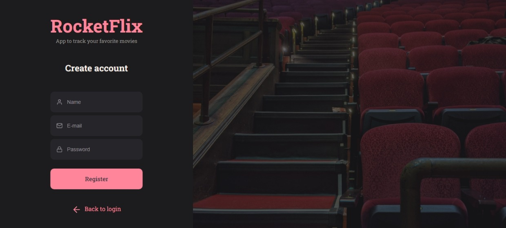
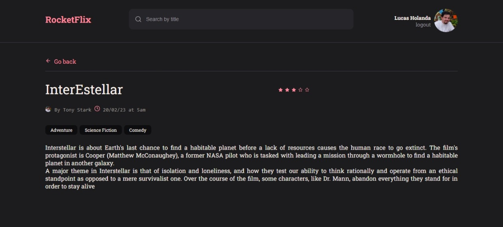
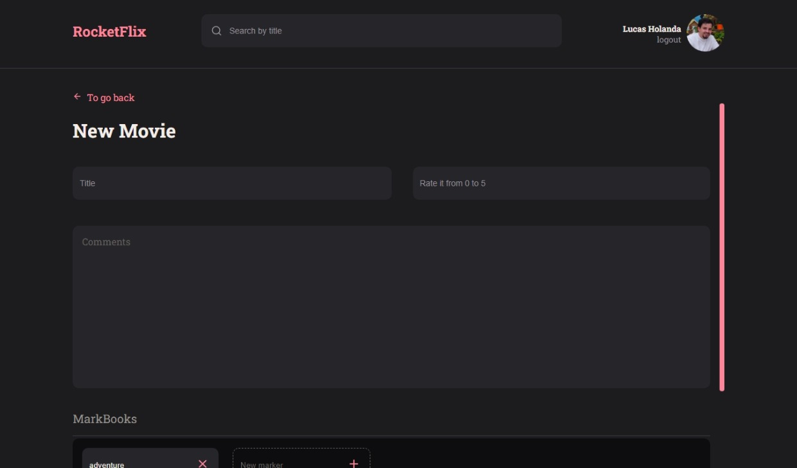
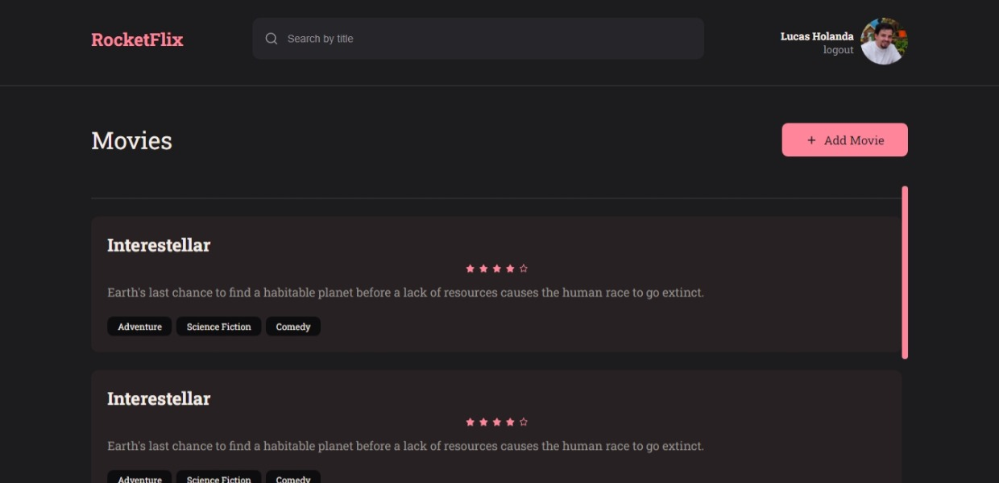
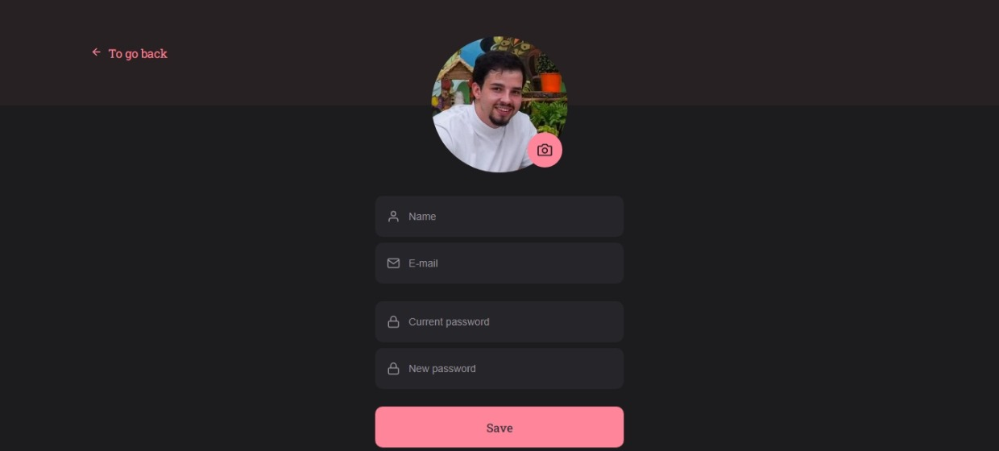

<h1 align="center"> RocketFlix </h1>

Projeto Frontend Stage 09 - do Explorer Rocketseat   

  <a href="#-tecnologias">Tecnologias</a>&nbsp;&nbsp;&nbsp;|&nbsp;&nbsp;&nbsp;
  <a href="#-projeto">Projeto</a>&nbsp;&nbsp;&nbsp;|&nbsp;&nbsp;&nbsp;
  <a href="#-layout">Layout</a>&nbsp;&nbsp;&nbsp;|&nbsp;&nbsp;&nbsp;
  <a href="#memo-licença">Licença</a>

  

 

  
	
	
	
	
	

## 🚀 Tecnologias

Esse projeto foi desenvolvido com as seguintes tecnologias:

- HTML e CSS
- React JS
- JavaScript
- Vite
- Styled-components
- Git e Github
- Figma

## 💻 Projeto

O RocketFlix é um projeto desenvolvido no stage 9 do Explorer. Front-end do projeto RocketNotes que será integrado ao back-end após implementação da autenticação de usuários.

## 🔖 Layout

Você pode visualizar o layout do projeto através [DESSE LINK](<https://www.figma.com/file/vL4ezkGQoSF8YKjN2hiNyT/RocketMovies-(Copy)?node-id=8%3A506&t=babptkUyzlD1YKT7-1>). É necessário ter conta no [Figma](https://figma.com) para acessá-lo.

## :memo: Licença
Deploy: https://notesholanda.netlify.app/
Esse projeto está sob a licença MIT.

---

Contato ♥ :wave:

  <a href="https://www.linkedin.com/feed/"  target="_blank">LinkedIn</a>&nbsp;&nbsp;&nbsp;|&nbsp;&nbsp;&nbsp;
  <a href="https://www.instagram.com/holandaa_lucaas/" target="_blank">Instagram</a>&nbsp;&nbsp;&nbsp;|&nbsp;&nbsp;&nbsp;
  <a href="mailto:lucashcardoso26@gmail.com">Email</a>

